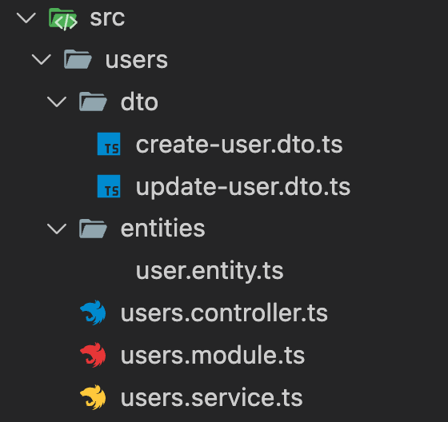

# Mi primer Crud.

Veremos como hacer un crud paso a paso que tira de un array de personas.

Creamos el proyecto:

```jsx
nest new project-name
```

Comandos útiles:

```jsx
# Crear una clase
nest g cl <path/nombre>

# Crear un controlador
nest g co <path/nombre>

# Crear un decorador
nest g d <path/nombre>

# Crear un guard
nest g gu <path/nombre>

# Crear un interceptor
nest g in <path/nombre>

# Crear un módulo
nest g mo <path/nombre>

# Crear un pipe
nest g pi <path/nombre>

# Crear un servicio
nest g s <path/nombre>

# Crear un recurso completo. Comando muy muy muy útil.
nest g resource <nombre>.   
```

En nuestro caso haremos:

```jsx
 nest g res users 
```


Esto crea lo siguiente:





También es útil deshabilitar el control de errores tan estricto de Nest:

```jsx
yarn remove prettier
yarn remove "eslint-config-prettier" "eslint-plugin-prettier"
```

## Módulos

https://docs.nestjs.com/modules

En los módulos tenemos:

| providers | Irán los inyectores de dependencia o lógica de negocio. |
| --- | --- |
| controllers | Definiremos las rutas y los elementos de servicio a invocar. |
| imports | Módulos a importar requeridos por este módulo. |
| exports | Si este módulo tiene servicios requeridos por otro se pondrán aquí. |

## Controladores

https://docs.nestjs.com/controllers

Determinarán las rutas que cubren ese módulo y los servicios que se invocarán en cada caso.

Ejemplo:

```jsx
import { Controller, Get, Post, Body, Patch, Param, Delete } from '@nestjs/common';
import { UsersService } from './users.service';
import { CreateUserDto } from './dto/create-user.dto';
import { UpdateUserDto } from './dto/update-user.dto';

@Controller('users')
export class UsersController {
  constructor(private readonly usersService: UsersService) {}

  @Post()
  create(@Body() createUserDto: CreateUserDto) {
    return this.usersService.create(createUserDto);
  }

  @Get()
  findAll() {
    return this.usersService.findAll();
  }

  @Get(':id')
  findOne(@Param('id') id: string) {
    return this.usersService.findOne(+id);
  }

  @Patch(':id')
  update(@Param('id') id: string, @Body() updateUserDto: UpdateUserDto) {
    return this.usersService.update(+id, updateUserDto);
  }

  @Delete(':id')
  remove(@Param('id') id: string) {
    return this.usersService.remove(+id);
  }
}

```

## Servicios, inyección de dependencias.

https://docs.nestjs.com/providers

Los servicios indican la lógica de negocio, es decir el código que hace cosas.

Lo primero es definir la entidad que será el modelo que usa el servicio para manejar los datos que se sirve, user-entity.ts:

```jsx
export class User {

    id: number;
    name: string;
    email: string;
    age: number;

}
```

Luego el servicio, que implementa la lógica de negocio.

Ejemplo:

```jsx
import { Injectable } from '@nestjs/common';
import { CreateUserDto } from './dto/create-user.dto';
import { UpdateUserDto } from './dto/update-user.dto';
import { User } from './entities/user.entity';

@Injectable()
export class UsersService {

  //Simulamos la bd. 
  private users : User[]= [
    {
      id: 1,
      name: 'Daniel',
      email: 'daniel@example.com',
      age: 30
    },
    {
      id: 2,
      name: 'Cynthia',
      email: 'cynthia@example.com',
      age: 25
    }
  ];

//Función auxiliar que da un id único al registro.
  private generateUniqueId = () => {
    let newId;
    do {
      newId = Math.floor(Math.random() * 1000) + 1;
    } while (this.users.some(user => user.id === newId)); 
    return newId;
  };

  create(createUserDto: CreateUserDto) {
      const user = new User();
      user.id = this.generateUniqueId();
      user.name = createUserDto.name;
      user.email = createUserDto.email;
      user.age = createUserDto.age;

      /*

      if (!usuario) {
      throw new NotFoundException(`Usuario con ID ${id} no encontrado`);
    }
      if (error.code === 11000) {
        throw new BadRequestException('El nombre de usuario ya existe')
      }
      throw new InternalServerErrorException('Error al crear el usuario - Revisar logs')
      */

      this.users.push(user);
      return user; 
  }

  findAll() {
    return this.users;
  }

  findOne(id: number) {
    if (this.users.find(user => user.id === id) === undefined) {
      return {msg: 'User not found'};
    }
    return this.users.find(user => user.id === id);
  }

  update(id: number, updateUserDto: UpdateUserDto) {
      const userIndex = this.users.findIndex(user => user.id === id);
    
      if (userIndex === -1) {
        return { msg: 'User not found' };
      }
    
      //Actualizar solo los campos proporcionados en updateUserDto
      //Operador spread (...): Se mantiene el objeto original y solo se sobrescriben los valores proporcionados en updateUserDto, dejando los demás intactos.
      //Utiliza el operador spread (...) para fusionar el usuario existente con los nuevos datos 
      this.users[userIndex] = { ...this.users[userIndex], ...updateUserDto };
    
      return this.users[userIndex];
  }
  

  remove(id: number) {
      const userIndex = this.users.findIndex(user => user.id === id);
    
      if (userIndex === -1) {
        return { msg: 'User not found' };
      }

      const deletedUser = this.users.splice(userIndex, 1)[0];
    
      return { msg: 'User deleted successfully', deletedUser };
  }
  
}

```

## Pipes

https://docs.nestjs.com/pipes

Son filtros de validación. Se pueden aplicar a un parámetro de una ruta: ParseIntPipe.

 

```jsx
@Get(':id')
  findOne(@Param('id', ParseIntPipe) id: number) {
      return this.usersService.findOne(id);
  }
```

## DTO (Data Transfer Object)

https://docs.nestjs.com/techniques/validation

Si queremos validar el body que nos llega, todos los parámetros: tipo, cantidad, nombre, valores, rango… validación en suma.

Debemos instalar las clases: 

```jsx
yarn add class-validator class-transformer
```

Definir los DTO, por ejemplo. 

Para crear:

```jsx
import { isNumberObject } from "node:util/types";
import { IsInt, IsString, IsEmail, Min, IsOptional } from 'class-validator';

export class CreateUserDto {
    
  @IsString()
  name: string;

  @IsEmail()
  email: string;

  @IsInt()
  @Min(0) // Para evitar edades negativas
  age: number;
}

```

Y DTO para actualizar:

```jsx
import { PartialType } from '@nestjs/mapped-types';
import { CreateUserDto } from './create-user.dto';
import { IsInt, IsString, IsEmail, Min, IsOptional } from 'class-validator';

export class UpdateUserDto extends PartialType(CreateUserDto) {
     
    @IsOptional()
    @IsString()
    name: string;
    
    @IsOptional()
    @IsEmail()
    email: string;

    @IsOptional()
    @IsInt()
    @Min(0) // Para evitar edades negativas
    age: number;
}

```

Se puede pasar esa validación en los siguientes sitios.

1. En la ruta.
    
    Ejemplo:
    
    ```jsx
     import { Controller, Get, Post, Body, Patch, Put, Param, Delete, ParseIntPipe,ValidationPipe, UsePipes } from '@nestjs/common';
    	@Post()
      @UsePipes(ValidationPipe) //Se pasa automáticamente la de CreateUserDto.
      
      //o ampliando la validación:
    
    	@Post()	
    	@UsePipes(new ValidationPipe({  //Validación global
    	    whitelist: true, //Rechaza campos no definidos en el DTO
    	    forbidNonWhitelisted: true, //Lanza un error si hay campos extra
    	    transform: true //Convierte tipos automáticamente
    	  }))
    	  create(@Body() createUserDto: CreateUserDto) {
    	    return this.usersService.create(createUserDto);
    	  }
    ```
    
2. En el controlador.
    
    Si se pone justo antes de la declaración se aplica a todas las rutas que tengan definido un DTO; cada uno al suyo, automáticamente:
    
    ```jsx
    @Controller('users')
    @UsePipes(ValidationPipe)
    
    //o ampliando la validación:
    @Controller('users')
    @UsePipes(new ValidationPipe({  //Validación global
        whitelist: true, //Rechaza campos no definidos en el DTO
        forbidNonWhitelisted: true, //Lanza un error si hay campos extra
        transform: true //Convierte tipos automáticamente
      }))
    
    ```
    
3. En toda la aplicación.
    
    En main.ts, definimos:
    
    ```jsx
      app.useGlobalPipes(new ValidationPipe({  //Validación global
        whitelist: true, //Rechaza campos no definidos en el DTO
        forbidNonWhitelisted: true, //Lanza un error si hay campos extra
        transform: true //Convierte tipos automáticamente
      }));
    ```

  
  ---
  # Arquitectura resumida:
  ### Controller
  ###  ↓
  ### Guards
  ###   ↓
  ### Interceptors
  ###   ↓
  ### Pipes
  ###   ↓
  ### NestJS Core
  ###   ↓
  ### Express (o Fastify)
  ###   ↓
  ###  Node.js
